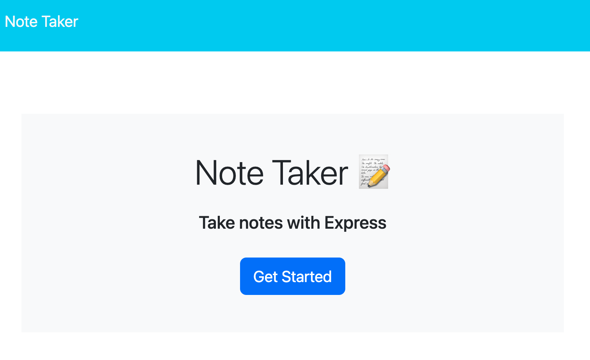
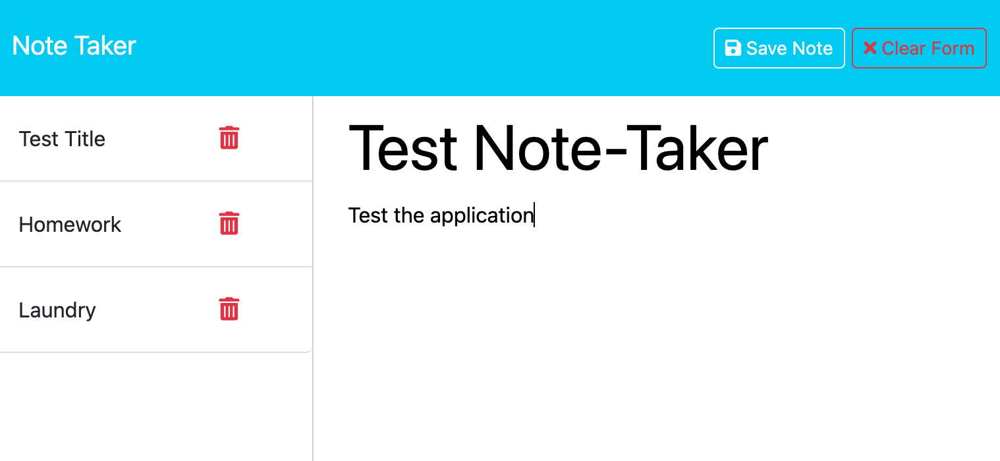

 # Note Taker 📝

 
 
 ## Description
This application aims to make it easy to jot down quick notes and keep them all in one location. With this web application, you can add a title and some text to a note and click "Save Note" and the note will appear in a list of all previously saved notes on the lefthand side of the webpage. When you want to delete a note, you can click the trashcan button on the righthand side of that specific note and the note will be trashed. 

 ## Table of Contents
 - [Installation](#installation)
 - [Usage](#usage)
 - [Demo](#demo)
 - [Tests](#tests)
 - [License](#license)
 - [Questions](#questions)

## Installation
You install this project a few different ways. You could deploy it from VS code to a local port, or you could use a program such as Insomnia or Heroku to deploy the page.

## Usage
The application is used by opening it to whichever means you choose (the local port or an application such as Heroku or Insomia). From there you will arrive at a landing page that prompts you to "Get Started" with Note Taker. When you click that button, you are redirected to a page that allows you to create new notes and shows previously saved notes on the lefthand side. You can create new notes from here or save or delete previously saved notes. 

## Demo
Below is a visual of the application.

The landing page prompts you to click "Get Started".

The notes page shows existing notes in the lefthand column and an empty title and text field on the righthand side where you can add new notes.

Click [here](/photo%20assets/Landing-Page.png) for a demonstration of the application.

## Tests
This application can be tested by trying to write and save a note. When you save it, the new note should appear in the lefthand column of previously saved notes.

## License
This project is not licensed.

## Questions

Contact me with any other questions regarding this project via the email listed below
GitHub: [@huntrreed](https://github.com/huntrreed)
Email: huntrreed@gmail.com

### Deployed Link
[Deployed Application Page](https://fast-citadel-83949-c361f994199c.herokuapp.com/notes)
